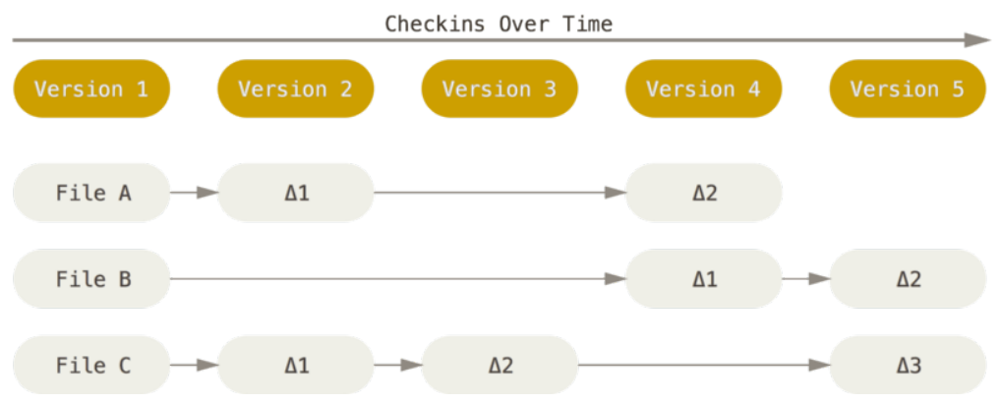
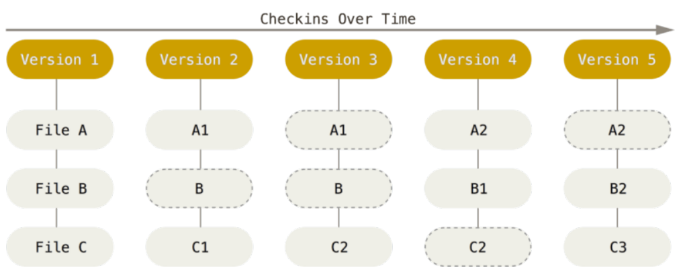
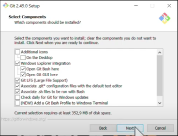
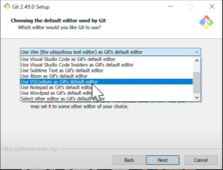
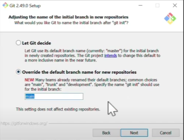

# Documentación Git

Todo lo que estoy aprendiendo de Git.

## Indice
- [1. Introducción](#introduccion)
    - [¿Que es git?](#que-es-git)
    - [¿Como maneja y almacena sus datos?](#como-maneja-y-almacena-sus-datos)
    - [¿Porque es rapido?](#porque-es-rapido)
    - [Los tres estados](#los-tres-estados)
    - [Instalación y configuración inicial](#instalación-y-configuración-inicial)
- [2. Fundamentos](#fundamentos)
    - [Git init](#git-init)
    - [Git clone](#git-clone)
    - [Git status](#git-status)
    - [Git add](#git-add)
    - [.gitignore](#gitignore)
    - [Git diff](#git-diff)
    - [Git commit](#git-commit)
    - [Git rm](#git-rm)

## Introducción

### ¿Que es Git?

Git es una herramienta de control de versiones. Es decir, es un sistema que registra los cambios realizados por una o mas personas y nos permite recuperar versiones especificas.

### ¿Como maneja y almacena sus datos?

Git a diferencia de los demas sistemas de almacenamiento de informacion, crea una copia instantanea del proyecto. En cambio, los otros crean una version diferente por cada modificacion que se realice.



```bash
  Nota: Cada version es un documento diferente
```

Por su parte git, maneja sus datos como un conjunto de copias instantaneas, cuando creas un proyecto, guarda una referencia y si no haces alguna modificacion, git no almacena de nuevo la informacion, sino, guarda la referencia anterior del archivo.



### ¿Porque es rapido?

Para navegar por la historia del proyecto, Git no necesita conectarse al servidor para obtener la historia y mostrartela, ya que lo lee directamente de tu base de datos local. De esta manera ves la informacion de manera inmediata.

### Los tres estados

Git tiene tres estados fundamentales:

- **Confirmado**: Los datos estan almacenados en la base de datos local.

- **Modificado**: Has hecho alguna modificacion, no confirmado en la base de datos local.

- **Preparado**: Has marcado el archivo modificado que pronto estará confirmado.

Las tres secciones importantes de un poryecto Git:

- **Directorio Git**: En el se encuentran los metadatos del proyecto, eso es lo que se copia cuando clonas un proyecto.

- **Directorio de trabajo**: Es una copia de una version del proyecto.

- **Area de preparación**: Es un archivo que almacena información que irá en tu proxima confirmación.

Flujo de trabajo de Git:

- Modificas unos archivos del directorio de trabajo. 

- Preparas los archivos añadiendolos al area de preparación.

- Confirmas los cambios del area de preparación y se almacena al directorio git.

### Instalación y configuración inicial

### Instalación de Git

- Verifica que este el git bash here



- En este apartado pregunta sobre el editor visual a usar



- Acerca de la rama principal, ahora se utiliza el main



### Configuración incial de Git

- Para ver la version de git que tienes.

```bash
  $ git --version 
```

- Lo primero que tienes que hacer es poner tu identidad, ya que es lo que git usará en todos los commits. Solo se hace una vez.

```bash
  $ git config --global user.name "Jhordan Calixto" 
  $ git config --global user.email calixto4211@gmail.com
```

## Fundamentos

### Git init

```bash
  $ git init
```
Cuando se utiliza este comando se crea un subdirectorio llamado .git el cual contiene todos los archivos del repositorio.

### Git clone

Para poner el clonar un repositorio en el cual te gustaria interactuar, se usa el siguiente comando:

```bash
  $ git clone [url]
```

### Git status

Para poder revisar el estado de tus archivos puedes usar el siguiente comando:

```bash
  $ git status
```
Te permite saber que archivos estan rastreados y los que no, asimismo te muestra la rama en la que te encuentras.

### Git Add

A traves de este comando podremos empezar a rastrear los archivos que hemos modificado para luego poder confirmarlos de ser el caso.

### .gitignore

Se usa cuando quieres que Git no rastree ciertos archivos y para ello puedes crear un archivo gitignore.

### Git diff

Se puede usar si quieres saber exactamente lo que has añadido o eliminado del archivo.

### Git commit

Una vez tu area de preparación esta como desees, podras confirmar tus cambios. Recuerda que solo confirmara los cambios que esten rastreados.

Si quieres omitir el area de preparación, puedes utilizar el siguiente comando:

```bash
  $ git commit -a -m "add message"
```
Haras que lo prepare y lo confirme automaticamente.

### Git rm


